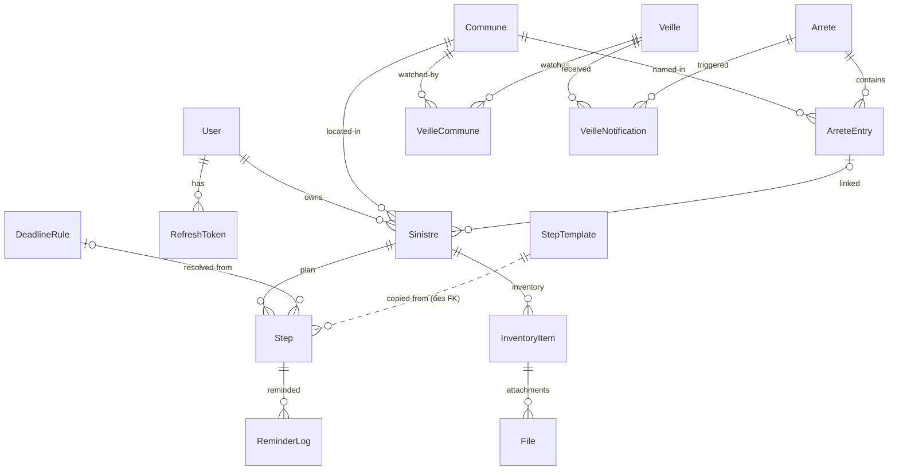

# Research: модель данных ядра

**Дата**: 2026-07-30
**Статус**: принят владельцем проекта 30.07.2026 — открытые вопросы 1–4 решены
(§ 8), учтено внешнее ревью (правило отображения communeLabelRaw, contentHash,
duration+unit, ReminderLog.kind, File.contentSha256, семантика updatedAt)
**Обновлён**: 02.08.2026 по итогам внутреннего ревью — PostgreSQL 18 /
`uuidv7()`, синхронизация contracts (`duration`+`unit`, `communeLabelRaw`),
`ReminderLog.plannedDate`, алерт при смене `outcome`, транзитивный резолв
преемника, `nameNormalized`, сводка ручного SQL (§ 1).
**Входные данные**: `packages/contracts/src/` (доменные типы), ТЗ §§ 2–7.

Документ фиксирует реляционный слой под уже принятую доменную модель contracts:
связи, ключи, ограничения, каскады удаления. Таблицы создаются миграциями тех
фаз, которым они впервые нужны, — этот документ карта, а не миграция.

## 1. Принципы отображения

| Домен (contracts)    | Postgres / Prisma                                                                                                                             |
| -------------------- | --------------------------------------------------------------------------------------------------------------------------------------------- |
| `IsoDate`            | `date` (`@db.Date`), никогда `timestamp`                                                                                                      |
| `IsoDateTime`        | `timestamptz`                                                                                                                                 |
| Деньги (`costCents`) | `integer`, центы                                                                                                                              |
| Enum'ы contracts     | Prisma `enum` с теми же значениями                                                                                                            |
| `SourceReference`    | пара колонок `sourceUrl` + `sourceVerifiedAt`; `possiblyOutdated` **вычисляется на чтении** (старше 6 мес., константа contracts), не хранится |
| id                   | `uuid` (v7 — сортируемость по времени), генерация на стороне БД: `uuidv7()` нативна с PostgreSQL 18                                           |

Статусы шагов: в базе только `FAIT` / `NON_APPLICABLE` — колонка
`persistedStatus` (nullable enum из двух значений); остальное вычисляется.
Готовность досье — тоже вычисляется, в базе ничего нет.

**Ручной SQL в миграциях.** Всё, чего Prisma не выражает, дописывается SQL
руками в файл миграции (миграции это позволяют): exclusion-ограничение
`DeadlineRule` (§ 3), частичный unique `ArreteEntry` «где codeInsee
сопоставлен» (§ 4), обе условные уникальности `ReminderLog` (§ 6), частичный
индекс `Step(plannedDate)` (§ 5). Имя колонки `order` (Step, StepTemplate)
Prisma экранирует сама, но в ручном SQL оно пишется только в кавычках —
зарезервированное слово.

## 2. Обзор

## 3. Справочники (versioned reference data)

### DeadlineRule

Решение от 30.07.2026: effective-dated, резолв по дате якоря.

| колонка                     | тип              | примечание                                                                            |
| --------------------------- | ---------------- | ------------------------------------------------------------------------------------- |
| id                          | uuid PK          | на неё ссылается `Step.deadlineRuleId`                                                |
| code                        | text             | семейство: `DECLARATION_ASSUREUR`, `CONTESTATION_REFUS`, …                            |
| duration                    | int              | вместе с `unit`; месяц ≠ 30 дней — сроки страховщика в законе формулируются в месяцах |
| unit                        | enum DAYS/MONTHS |                                                                                       |
| anchor                      | enum StepAnchor  |                                                                                       |
| effectiveFrom               | date             |                                                                                       |
| effectiveTo                 | date, null       | null = действует                                                                      |
| sourceUrl, sourceVerifiedAt | text, date       |                                                                                       |

Ограничения: `unique(code, effectiveFrom)`; непересечение интервалов одного
`code` — exclusion-ограничение по `daterange` (btree_gist). Prisma такое не
выражает — SQL руками (общее правило, § 1).
Строки не редактируются задним числом: новая версия = новая строка + закрытие
предыдущей.

### Commune

Решение от 30.07.2026: справочник на основе COG, версионируется; annexe
сопоставляется по «имя + департамент». Прагматичная схема — **идентичность по
коду, история через преемника**, а не полная темпоральность имён:

| колонка                                | тип                  | примечание                                                                                                                           |
| -------------------------------------- | -------------------- | ------------------------------------------------------------------------------------------------------------------------------------ |
| codeInsee                              | text PK              | естественный ключ; на него ссылаются Veille, Sinistre, ArreteEntry                                                                   |
| name, departementCode, departementName | text                 |                                                                                                                                      |
| nameNormalized                         | text                 | для поиска и сортировки (lower + без диакритики), пишет только импорт — `docs/research/commune-referential.md`, добавляется в фазе 3 |
| effectiveTo                            | date, null           | null = код действует в актуальном COG                                                                                                |
| successorCodeInsee                     | text, null → Commune | куда влилась commune nouvelle                                                                                                        |
| sourceUrl, sourceVerifiedAt            | text, date           | geo.api.gouv.fr + издание COG                                                                                                        |

Устаревшие коды **не удаляются**: arrêté (и старый синистр) может ссылаться на
код, которого в актуальном COG нет, — строка остаётся с `effectiveTo` и ссылкой
на преемника. Переименование коммуны без смены кода обновляет `name` на месте.

**Правило отображения** (внешнее ревью, 30.07.2026): исторический контекст
(экран arrêté, привязка синистра к annexe) показывается из
`ArreteEntry.communeLabelRaw` — как напечатано в JO; `Commune.name` — только для
актуального справочника (подписка, онбординг). Поэтому история имён в
справочнике не нужна: она уже хранится в entries.

`successorCodeInsee` используется **только на чтении**: fan-out уведомлений
(подписчик влившейся коммуны продолжает получать arrêtés преемника — иначе
подписка молча умирает при слиянии) и подпись «теперь часть X». Цепочка
преемников (A → B → C при повторных слияниях) резолвится итеративно до
актуального кода, с защитой от цикла (решение 02.08.2026). Строки Veille и
Sinistre при слиянии **никогда не переписываются** (решение — вопрос № 4).

### StepTemplate

Шаблоны плана. К contracts добавляется колонка **`planKey`** — вариант плана:
`CATNAT` (основной) и `CATNAT_REFUS` (шаги после отказа, решение об
`ARRETE_REFUSE`). Движок риск-агностичен (ТЗ § 8): v2 добавит новые `planKey`
без изменения схемы.

| колонка                     | тип              |
| --------------------------- | ---------------- |
| id                          | uuid PK          |
| planKey                     | text             |
| name, description           | text             |
| anchor                      | enum StepAnchor  |
| offsetDays                  | int, null        |
| deadlineRuleCode            | text, null       |
| required                    | bool             |
| order                       | int              |
| sourceUrl, sourceVerifiedAt | text, date, null |

Шаг шаблона — одной из трёх форм: продуктовый (задан `offsetDays`),
юридический (задан `deadlineRuleCode` — длительность берётся из `DeadlineRule`,
и юридической цифры в seed'е нет) или памятка (пусты оба — дата неизвестна в
принципе); `docs/research/sinistre-plan.md`, § «Схема».

`unique(planKey, order)`. Шаблоны меняются только seed'ом; версионирование не
нужно — синистр хранит копию плана (§ 5), шаблон никогда не читается задним
числом.

## 4. Монитор JO

### Arrete

`nor` — `unique` (ключ дедупликации). Плюс служебные поля монитора:
`firstSeenAt`, `lastSeenAt` (timestamptz) — когда монитор впервые/последний раз
встретил NOR в дельтах DILA; `contentHash` (SHA-256 текста) — дельты DILA
пересылают и неизменённые тексты, совпадение хэша = повтор без изменений
(только `lastSeenAt`), несовпадение = настоящий rectificatif. `publishedAt` —
только из XML (правило проекта).

### ArreteEntry

| колонка                         | тип                      | примечание                                                                                                    |
| ------------------------------- | ------------------------ | ------------------------------------------------------------------------------------------------------------- |
| id                              | uuid PK                  |                                                                                                               |
| arreteId                        | uuid → Arrete, cascade   |                                                                                                               |
| codeInsee                       | text, **null** → Commune | null = не сопоставлено → алерт                                                                                |
| communeLabelRaw, departementRaw | text                     | как напечатано в annexe — след для сверки и разбора алертов                                                   |
| risque                          | text                     |                                                                                                               |
| eventStart, eventEnd            | date                     |                                                                                                               |
| outcome                         | enum RECONNU/REFUSE      |                                                                                                               |
| motivation                      | text, null               | для обеих annexes (доказательный текст), не только REFUSE                                                     |
| createdAt                       | timestamptz              | иммутабелен: когда строка появилась из JO — звено доказательной цепочки                                       |
| updatedAt                       | timestamptz              | **технический** («строку кто-то потрогал», включая ручную починку mapping'а) — в доказательствах не участвует |

`unique(arreteId, codeInsee, risque, eventStart, eventEnd)` — где codeInsee
сопоставлен. Rectificatif (повторный NOR, изменившийся `contentHash`) обновляет
entries существующего arrêté; факт изменения логируется, таблица ревизий не
заводится, пока у истории нет читателя (решение 30.07.2026 — вопрос № 2).
Вопрос «почему письмо пришло 12-го, а не 8-го» отвечается из базы без ревизий:
`Arrete.firstSeenAt` (оригинал — 8-го) → `ArreteEntry.createdAt` (строка
коммуны появилась в rectificatif 12-го) → `VeilleNotification.sentAt` (письмо —
в тот же день). Момент изменений **из JO** якорится на уровне арретé
(`lastSeenAt` + смена `contentHash`), а не на `updatedAt` строки: rectificatif —
событие арретé; `updatedAt` меняется и от ручных правок, строить на нём
доказательства нельзя (внешнее ревью, 30.07.2026). Жёсткое правило:
**изменение entry, к которому привязан хотя бы
один синистр** (исход, период события, риск), — алерт администратору, как
нераспознаваемая структура: оно меняет чьи-то юридические сроки и требует глаз
человека, а не тихого апдейта. Смена `outcome` существующего entry — алерт
**всегда**, даже без привязанных синистров: наблюдатели Veille второго письма
автоматически не получают (`unique(veilleId, arreteId)`, § 6), решение об их
повторном уведомлении принимает человек при разборе алерта (решение
02.08.2026).

### JorfDelta

`fileName` (text PK, имя дельты `JORFSIMPLE_YYYYMMDD-HHMMSS.tar.gz`),
`processedAt` (timestamptz). Смысл строки и порядок обработки —
docs/research/jorf-monitor.md, «Расписание прогонов».

### MonitorAlert

id, `kind` enum (`UNPARSEABLE_ANNEXE` / `UNMATCHED_COMMUNE` /
`OUTCOME_CHANGED` / `NOTIFICATION_STUCK`), `detail` text, `arreteId` uuid null → Arrete (**SetNull**,
не cascade — алерт переживает удаление породившего его arrêté), `createdAt`.
Поводы и содержимое `detail` — docs/research/jorf-monitor.md, «Алерты
администратору».

## 5. Аккаунт и синистр

### User, RefreshToken

Auth уже решён (api/CLAUDE.md): Passport local + JWT, refresh с ротацией.

- `User`: id, email `unique`, passwordHash, `confirmedAt` (null = не
  подтверждён, вход невозможен), `confirmTokenHash` `unique`,
  `confirmExpiresAt`, createdAt. Email в логи не попадает.
- `RefreshToken`: id, userId → User (cascade), tokenHash `unique`, expiresAt,
  revokedAt null. Ротация = вставка нового + revoke старого; чистка истёкших —
  фоновая задача.
- `PasswordReset`: id, userId → User (cascade), tokenHash `unique`, expiresAt,
  usedAt null (фаза 3).
- `AccountFormEmail`: id, emailHash, sentAt; индекс `(emailHash, sentAt)` —
  счётчик писем формы аккаунта, по образцу `VeilleFormEmail` (§ 6). `LoginAttempt`:
  id, emailHash, attemptedAt; тот же приём — счётчик неудачных попыток входа.
  Оба — HMAC-хеш адреса (`ACCOUNT_EMAIL_HASH_SECRET`, отдельно от секрета
  veille), а не userId: лимиты обязаны работать и для несуществующих адресов
  (анти-enumeration). Детали фазы 4 — `docs/research/user-account.md`.

### Sinistre

| колонка         | тип                                    | примечание                                                    |
| --------------- | -------------------------------------- | ------------------------------------------------------------- |
| id              | uuid PK                                |                                                               |
| userId          | uuid → User, cascade                   | в contracts поля нет — принадлежность неявна в API, явна в БД |
| codeInsee       | text → Commune                         |                                                               |
| risque          | text                                   | свободный до привязки entry                                   |
| eventDate       | date                                   |                                                               |
| arreteEntryId   | uuid, null → ArreteEntry, **restrict** | перепривязывается при признании после отказа                  |
| declarationDate | date, null                             |                                                               |
| status          | enum SinistreStatus                    |                                                               |
| createdAt       | timestamptz                            |                                                               |

Индексы: `(userId)`. Отложен `(codeInsee, status)` — запрос, ради которого он
объявлен, читает всех кандидатов без сужения по коммуне; индекс заводит та фаза,
где выборка начнёт сужаться (`docs/research/sinistre-plan.md`, § «Привязка entry
↔ синистр»).

### Step — копия плана

Снапшот: при создании синистра строки шаблона **копируются**; шаблон дальше не
читается. Для дорасчёта дат при появлении якоря копия обязана хранить и якорь,
и смещение:

| колонка                     | тип                                 | примечание                                                 |
| --------------------------- | ----------------------------------- | ---------------------------------------------------------- |
| id                          | uuid PK                             |                                                            |
| sinistreId                  | uuid → Sinistre, cascade            |                                                            |
| name, description           | text                                |                                                            |
| anchor                      | enum, null                          | null у шагов, добавленных пользователем                    |
| offsetDays                  | int, null                           | в contracts `Step` поля нет — оно серверное, для пересчёта |
| plannedDate                 | date, null                          | null, пока якорь не наступил                               |
| persistedStatus             | enum FAIT/NON_APPLICABLE, null      | остальные статусы — на чтении                              |
| completedAt                 | date, null                          |                                                            |
| fromTemplate                | bool                                | false → шаг никогда не пересчитывается                     |
| deadlineRuleId              | uuid, null → DeadlineRule, restrict | какая версия правила дала дату (решение от 30.07.2026)     |
| order                       | int                                 |                                                            |
| sourceUrl, sourceVerifiedAt | text/date, null                     | копия из шаблона или правила                               |

Индекс `(plannedDate) where persistedStatus is null` — ежедневный отбор
напоминаний; заводится вместе с этим запросом, той же фазой.

Семантика редактирования (вместо отдельной колонки `systemManaged` — внешнее
ревью, решение 30.07.2026): у шаблонного шага (`fromTemplate = true`) дата
управляется системой, пользователю доступны только `FAIT` / `NON_APPLICABLE`;
свой шаг (`fromTemplate = false`) целиком его — система не пересчитывает
никогда. Если v1.x разрешит двигать даты шаблонных шагов, появится флаг
«дата переопределена вручную» — это другая семантика, не `systemManaged`.

### InventoryItem, File

- `InventoryItem`: id, sinistreId → Sinistre (cascade), name, brand,
  description, quantity, costCents, purchaseDate, warrantyUntil, serialNumber,
  createdAt. Индекс `(sinistreId)`.
- `File`: id, inventoryItemId → InventoryItem (cascade), kind (PHOTO /
  JUSTIFICATIF), fileName, contentType, sizeBytes, **storageKey** (ключ S3 —
  наружу не отдаётся, только короткие подписанные URL), **contentSha256**
  (алгоритм — в имени колонки: целостность доказательных файлов, проверка
  загрузки, задел на дедупликацию), uploadedAt. EXIF-ограничение — к пайплайну
  загрузки, не к схеме.

Цепочка владения: `File → InventoryItem → Sinistre → User`. Каждый запрос
фильтрует по `userId` **в условии** через join цепочки (правило: чужой и
несуществующий объект неразличимы, 404).

## 6. Veille и идемпотентность рассылок

- `Veille`: id, email, confirmedAt (null = не подтверждена, писем не получает),
  confirmTokenHash, unsubscribeTokenHash, confirmExpiresAt, createdAt. Токены
  хранятся хешами. `unique(email)` — одна veille на адрес; email нормализуется
  (lowercase, trim) до проверки уникальности. Три обязательных нюанса:
  изменение состава коммун — тоже double opt-in (зная чужой email, нельзя
  менять его подписку); ответ формы одинаков для нового и существующего адреса
  (анти-enumeration, созвучно правилу «чужой и несуществующий неразличимы»);
  нюансы `confirmExpiresAt` и токенов — `docs/research/veille-subscription-lifecycle.md`.
- `VeilleCommune`: veilleId → Veille (cascade), codeInsee → Commune
  (restrict); PK составной, индекс `(codeInsee)` — fan-out уведомлений в день
  arrêté.
- `VeilleFormEmail`: id, emailHash, sentAt; индекс `(emailHash, sentAt)` —
  счётчик писем формы, детали `docs/research/veille-subscription-lifecycle.md`.
- `VeilleNotification`: id, veilleId → Veille (cascade), arreteId → Arrete
  (restrict), **sentAt nullable** (`id` — uuidv7, § 1 — сортирует и очередь
  pending, отдельная `createdAt` не нужна), `attempts` int — счётчик неудачных
  отправок, по которому строка, падающая детерминированно, становится алертом
  вместо вечного молчаливого ретрая; `unique(veilleId, arreteId)` —
  повторный прогон монитора (rectificatif, ретрай) не шлёт письмо дважды.
  Outbox-паттерн и его обоснование — docs/research/jorf-monitor.md, «Рассылка:
  outbox на VeilleNotification».
- `VeilleChange`: неподтверждённая заявка на смену состава коммун — id,
  veilleId → Veille (cascade), changeTokenHash, communeCodes (скалярный
  массив), expiresAt, createdAt. `unique(veilleId)` — у подписки не может
  быть двух заявок разом, повторная форма переписывает единственную строку;
  подробности docs/research/veille-commune-change.md.
- `ReminderLog` (напоминания шагов): stepId → Step (cascade), **kind**
  (`SCALE` — напоминание по шкале, `OVERDUE` — о просрочке), offsetDays
  (факт: за сколько дней отправлено; для `OVERDUE` не используется),
  **plannedDate** (факт: для какой даты шага напоминали), sentOn (date);
  `unique(stepId, kind, offsetDays, plannedDate)` для `SCALE`,
  `unique(stepId, sentOn)` для `OVERDUE` (недельный интервал контролирует код).
  Даёт идемпотентность из ТЗ § 9 на уровне БД, а не только кода. `offsetDays`
  и `plannedDate` — факты, а не коды причин: при смене шкалы история остаётся
  читаемой, а пересчёт даты шага (перепривязка после отказа, rectificatif
  сместил период) открывает новую серию напоминаний для новой даты, вместо
  того чтобы молча подавить их прежней записью (решение 02.08.2026 — иначе
  продукт нарушал бы собственное обещание «не дать пропустить срок»).
  «Одно письмо в день» — группировка по userId при отправке, таблица не нужна.

## 7. Удаление (RGPD)

- **Veille**: hard delete по запросу/отписке — каскад сносит VeilleCommune,
  VeilleNotification и VeilleChange. Немедленно, без корзины (жёсткое
  требование ТЗ § 7).
- **User**: удаление аккаунта — каскад User → Sinistre → Step/InventoryItem →
  File строками БД **плюс** удаление объектов S3 по `storageKey`. Порядок:
  сначала собрать ключи, удалить строки транзакцией, затем чистить S3
  (недоудалённые объекты добирает фоновая сверка — S3 не участвует в
  транзакции БД).
- Справочники и данные монитора (Commune, Arrete, ArreteEntry, DeadlineRule,
  StepTemplate) персональных данных не содержат и не удаляются; FK из
  Sinistre/Step на них — `restrict`, чтобы чистка справочника не могла задеть
  пользовательские досье.

## 8. Открытые вопросы (решает владелец проекта)

1. ~~**Commune**: достаточно ли схемы «код + преемник» без истории
   переименований?~~ **Решено 30.07.2026: да, вариант «код + преемник»** —
   единственный сценарий со старым именем (annexe переименованной коммуны)
   деградирует в штатный алерт.
2. ~~**Rectificatif**: хватает ли лога приложения, или нужна таблица
   ревизий?~~ **Решено 30.07.2026: без таблицы ревизий** (YAGNI — у истории
   нет читателя ни в MVP, ни в v1.x). Доказательная цепочка описана в § 4:
   `Arrete.firstSeenAt` / `lastSeenAt` / `contentHash` /
   `ArreteEntry.createdAt` / `VeilleNotification.sentAt`; `updatedAt` имеет
   техническую семантику и в неё **не входит**. Обязательное дополнение —
   алерт при изменении entry с привязанными синистрами. Таблица ревизий
   добавляется одной миграцией, когда появится читатель.
3. ~~**Veille**: одна подписка на адрес или несколько?~~ **Решено 30.07.2026:
   `unique(email)`** — ни дублей писем, ни двусмысленной отписки, RGPD-удаление
   одной строкой; нюансы (double opt-in на изменение, анти-enumeration,
   нормализация) — в § 6. Внешнее ревью согласно.
4. ~~**Sinistre → Commune** при слиянии коммун?~~ **Решено 30.07.2026: никогда
   не переносить** — синистр и veille остаются на историческом коде;
   `successorCodeInsee` работает только на чтении (fan-out, подпись «теперь
   часть X», § 3). Внешнее ревью согласно.
